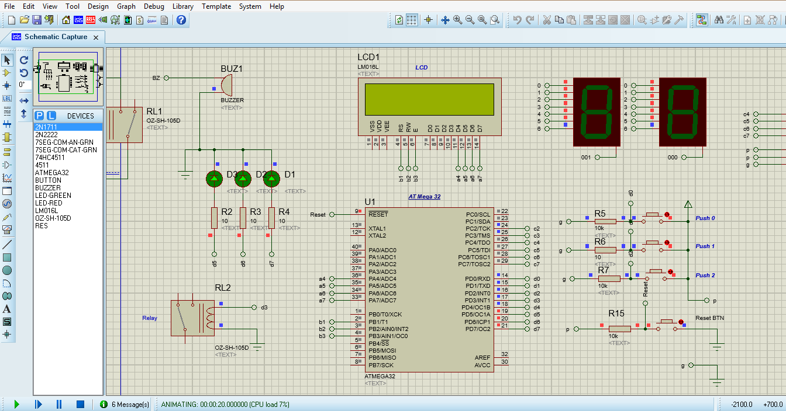

# GPIO LAB 0

## Project Overview

For this project, you should use GPIO module and make PORTD5, PORTD6, and PORTD7 as output pins to enable three LEDs that connected to them.

## Dependencies
- The microcontroller used for this project is atmega32 microcontroller.
- The IDE used for this project is eclipse and AVR Eclipse Plugin.
- The simulation tool for this porject is proteus 8 to simulation the atmega32 microcontroller.

