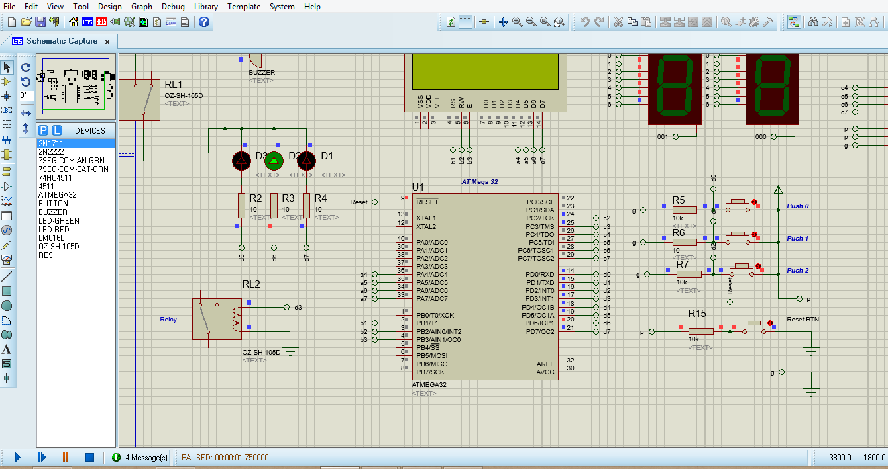

# GPIO LAB 1

## Project Overview

- For this project, you should use GPIO module to toggle 3 LEDs in sequential way then start a tick(pulse) by Buzzer then return again
- Port D pin 5,6,7 as output (LED)
- Port D pin 4 (Buzzer)

## Dependencies
- The microcontroller used for this project is atmega32 microcontroller.
- The IDE used for this project is eclipse and AVR Eclipse Plugin.
- The simulation tool for this porject is proteus 8 to simulation the atmega32 microcontroller.

